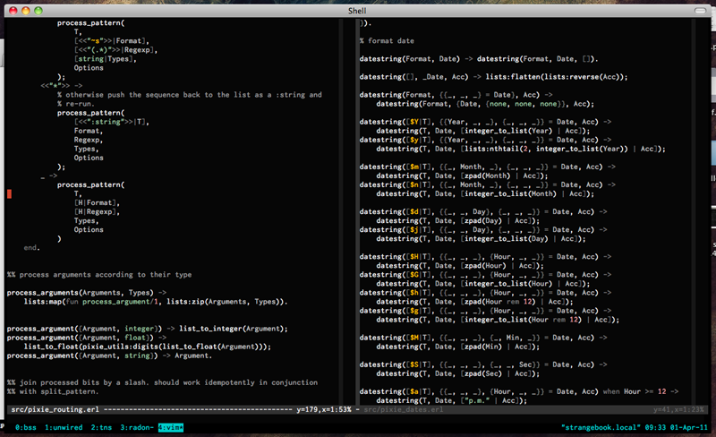
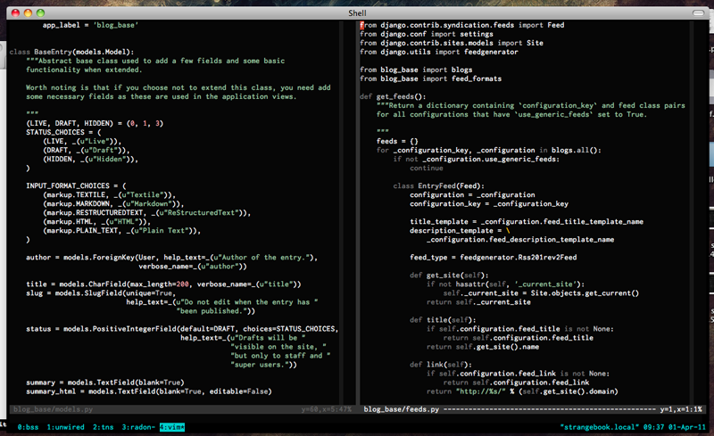

# Strange - A vim colour scheme

A muted color scheme that works in 8- and 256-color terminals, as well as in
the GUI versions of vim.

## Installation

http://vimcasts.org/episodes/synchronizing-plugins-with-git-submodules-and-pathogen/

## Screenshots

I added the screenshots directly to the repository. I'll make a separate page
of it when I get around to it.

## Caveats

There are still a few styles to add and to tweak. I'll add more as styles
as I find them lacking. Please do contact me if you want some hl group
added (gsjoberg@gmail.com).
